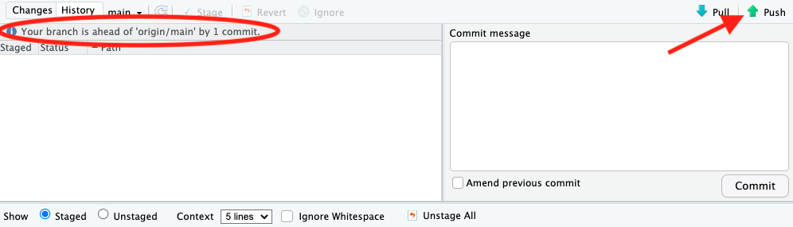

```{r setup, include=FALSE}
knitr::opts_chunk$set(echo = TRUE)
```

```{css, echo=FALSE}
.figure {
    display: block;
    margin-left: auto;
    margin-right: auto;
    width: 70%;
    text-align: center;
    font-weight: bold;
    padding: 10px;
}

```

## What is Git?

Git is a version control system that makes collaboration and makes roll backs simpler. It's like Google Doc's Version History but better for coding environments, especially when teammates need to work on separate parts of a project. Typically, each project lies in their own repository--often shortened to repo--which is basically the folder that holds all your source code, supporting documents, and history of your work. The repo is central to working with git. On your local computer, you'll have a local repo to store your work and history. With integration with GitHub or a similar hosting service, you can store a copy in the cloud and collaborate with a team. There, you can see what changes others have made and merge them into one version. 

We will be dealing with just the basics of Git and GitHub, but you still can do a lot with these two tools. We will also be using Git tools that come with RStudio to make life easier. Everything shown here can also be done using the command line if you are already familiar and prefer.

### How does git work?

As mentioned above, your project sits in a repository, or repo. This repo keeps track of your version history and branches. We don't have to worry about branches in this class since we're dealing with small and simple projects. Each "version" of your project is set by a *commit*. A commit is a snapshot of the edited files within the repo. All the commits chain together to create the version history for your project.

Locally, each person has a copy of commits on their computer. On GitHub, there is a remote copy of the commit history. To first get access to the repo, you  *clone* the remote repo to make a local copy. When you make changes to your project, you will *add* the changed files then *commit* them to your local repo chain (sometimes these two steps are combined into one). After this, you will *push* the commit to the remote repo so everyone can have access to your work. For others to get your changes, they will *pull* from the remote repo. If there ever is conflicting work on the local and remote copies, Git will attempt to *merge* the changes together to form a new complete commit; sometimes you may have to manually assist the merge.

With these six operations, you can use Git effectively.

## Getting Started

Before we can start utilizing Git, we need to download the tools, create accounts, and deal with settings.

### Downloads
* First make sure you have R installed: https://cran.rstudio.com/
* Also ensure you have RStudio: https://rstudio.com/products/rstudio/download/
* You likely do not have Git installed, so install it from here: https://git-scm.com/downloads and select your operating system
    * For Mac, select the option under "Binary installer"
* Finally, make an account on GitHub if you do not already have one: https://github.com/join

### Configuring RStudio for Git

1. Open the `Tools` drop down menu and select `Global Option`
2. Select the `Git/SVN` tab
3. Ensure *Enable version control interface for RStudio Projects* is **checked**
4. Make sure *Git executable* has the path to your installed Git

You can ignore *SVN* and *RSA*/*SSH*, as those aren't needed for this class. Your settings should look something like this:


### Configuring Git

Now that we have Git installed, we need to set some identifying information so others can know who wrote your commits. The email should be the same as your GitHub account email. The name can be your first name, full name, username, or any other identifier. I suggest you use your name for this class.

To set these settings, we need to open the terminal. There are a couple of ways to do this:

**If on Mac:** Search for and open the 'Terminal' app


**If on Windows:** Search for and open the 'Command Prompt' app


**Within RStudio, either OS:** Click the 'Terminal' tab near the bottom, next to the 'Console' tab


    
Once in the terminal, type in these two commands, putting your name and email, and press enter after each:

```
git config --global user.name "John Doe"
git config --global user.email "johndoe@example.com"
```

### GitHub Security

In the past, all you needed was your username and account password to work with GitHub. However, that was a single point failure and a security risk. Now, you need to create a special "password" separate from your login credentials to push and pull from GitHub. These come in two flavors: a *personal access token* for HTTPS or an *SHH Key* for SSH (HTTPS and SSH are two different protocols for communication over the web). HTTPS and personal access tokens have a simpler set up, so that's what we will be using for this class.

To create a personal access token, first go to GitHub and then account settings:

{height=500}

Then select `Developer settings` way at the bottom:

{height=500}

Within `Personal access tokens` / `Tokens (classic)` and under `Generate New Token`, select `Generate new token (classic)`:


Choose a descriptive name for your key so you know its purpose later. Something like "\<class number\> personal laptop" would be good. It's best to have separate token for each task and at the very least, each computer/system you use. This way, you can delete specific keys if they are compromised or are no longer needed.

Choose an expiration so that the date is after class ends. That way, you won't have to make a new one. For security, I would recommend not making it infinite.

Most importantly, select at least "repo" under the *Select Scopes* section. This allows us to use the key we are creating for push and pull operations. Your settings should look something like this:


Click `Generate Token`. The output will look like random sequence of numbers and letters. Copy this token and store it somewhere secure, such as a passwords manager. 

**DO NOT PUSH THE TOKEN TO GITHUB!** If you do, anyone could have access to your GitHub account.

If you do happen to push the token to GitHub, delete the token from your repo and delete it from your account. Create a new token afterwards. Also, if you lose the token, there is no way to recover it. Instead, you should delete the token from your account and create a new one.

If you ever need to delete a token, return to this page, find the correct token using the description you provided at creation, and then click the `Delete` button.

Remember where you stored your token. You will need this token for many Git operations.

#### A note about secrets on GitHub

Never push any secrets to GitHub, private or not. Repositories are not a secure location, even in a private repo, for confidential or high security information. Secrets should be encrypted and have limited access; repos offer neither. That means no keys should be written in your source code. If you ever accidentally commit a secret, purge the commit from your history before pushing. You can still purge a commit after pushing, but it is much harder to do so, and the secret should be changed after that point anyway. GitHub will often warn you if it detects something that looks like a private key on it's servers.

If you ever need to share secret information with a teammate, such as an API key, do it over more secure channels and store a copy locally using environment variables. If in the future you need to deal with a large team and many secrets, GitHub does offer secure ways to share secrets: [learn more here](https://docs.github.com/en/actions/security-guides/encrypted-secrets).

<br>

Now you should be all ready to start utilizing Git and GitHub. 

## Using Git

### Creating the remote repository

The first step to using Git is to create a remote repository to store and share your project. We are using GitHub for this purpose. To start, sign into GitHub and choose to create a `New` repo (it should be a green button either to the left or right of the home page). 

- Give your project a name. Try and make it descriptive.
    - Make sure it's one word. Kebab case is popular for repos: to414-project1, but you can use other forms if you'd like.
- Give a description if you'd like.
- Choose private or public.
    - This sets whether others can see and download your code without specified permission. Either way, changes can only be made if you give the proper permissions to those people.
- Check "Add README file".
    - This is a type of markdown file that usually contains a description of the repo. We add it so our repo doesn't start empty.
- Also select ".gitignore template: R".
    - The .gitignore file is a special text file that tells Git to ignore certain files and folders. This is important because you don't want to push files that relate only to your personal computer, such as caches or binary executables. The R template comes with all the files you'd typically come across when working with R and RStudio that shouldn't be shared across computers.
- You can leave license as "None".

After all the settings are set, the page should look something like this:


You can now click the `Create repository` button. 

#### Sharing the repo

Now that you've created the repo, you'll want to grant access to your teammates so they can push and pull from the repo. From your repo's home page, go to the `Settings` tab and go down to `Access`/`Collaborators`. Then click the `Add people` button:


You can add people by email or username if you know their username. Once they accept the invitation, you can edit their permissions if needed. If the repo was private, they can now see the source code and clone the repo. And for both private and public repos, they are allowed to push now.

### The local repository

Congratulations, you've created your first remote repository. Now we need a local repo to actually work on our project. 

To do this, we will *clone* our project. One way to do this is using RStudio's integration with Git. R Projects are an easy way to to work with Git. In R Studio, create a new project by selecting `New Project...` under the `File` drop down menu. When the New Project Wizard pops up, select `Version Control`:


Then select `Git`:


For the next step, we need to go back to GitHub and the repo we created in the last section. In the repo's home page, click the green `Code` button and copy the HTTPS URL:


Once copied, return to the New Project Wizard and paste the URL under the appropriate box. Also give your directory a name; it can be the same as the repository's name or different. Lastly, choose the directory you want your project stored in. Your Wizard should look similar to this:


When done, click `Create Project`. Congratulations, you've cloned your remote repo and are now ready to start adding code.

### Working with Git

#### Commiting Work

So now you have your remote repo and local repo, but what do you do with them? You can start working as normal, such as making your first RMarkdown files. If you are working in a group, only one of you need to create the initial files. Let's create a new RMarkdown file where we'll do all our work. We'll keep the temporary starting code for now. 

OK. Now we have some work done and want to share it with your teammates. To start, save your work. Next, we want to *commit* our work. Find the `GIT` drop down menu and select `Commit...`:


You will now be provided with a staging menu. Here you can view the files that you've made changes to and what those changes were. Select the files you want to be *staged*, i.e., the files you want to be *added* to the commit. It is important to write a small but meaningful message to your commit. There are a few reasons why:

1. The message is an identifier for the commit. With it, you can easily tell what that commit did. This is important if you ever need to revert work.
2. It allows others to know what you did and what changed at a glance. A good message will also give the "why" you are committing the work.

In this example, I have yet to do any work; I've only made the starting files. So, in my message, I'll call it "initial commit". This is usually the message you give when just adding a readme or starting files. Your staging menu should look something like this:


Once it looks good, press the `Commit` button. You'll get a popup, which just verifies the commit action. It will say how many files were changed, the amount of insertions and/or deletions, and then which files were changed. You can close the popup by pressing the `Close` button:


#### Pushing the Commit

Now the changes are committed to our local rep. If we needed to, we could roll back to a previous commit if we introduced errors. We are looking good, so our next step is to *push* our commit to the remote repo so everyone else can get our work. Notice how our staging menu is saying our branch is ahead of 'origin/main' by 1 commit. This is saying we have a local commit that is not in the remote repo. In the same staging menu, press the `Push` button:



You'll get a new popup asking for your username. Type your GitHub account username here, then press `OK`. Next it will ask for your password. This is not your account password; instead, it is the personal access token we made earlier. Find where you securely stored it and copy to here. Press `OK`.

You'll then get a confirmation that the commit worked. The confirmation is giving the hash of the commit(s), which is a commit's unique identifier; the origin of the commit; and where it is pushing to. Here, we have the commit originating from our local repo pushing to the main branch of the remote repo.

You can now close out of the popup and the staging window.

At this point, if you return to GitHub and reload your repo's page, you'll see the new files and our commit message next to them. Note that the files that were created for us by GitHub also have "Initial commit" as the message.


Once the initial files are pushed to GitHub, all your teammates can now clone the library and begin contributing.

#### Pulling

Let's set up a scenario. You've invited your partner Pat to this repo, and he's cloned the repo following the steps above. At this point, you both have the same starting files that we pushed in the last section. Pat is excited to get working, so he deletes the started code, adds a new section to the .Rmd file, and knits it. The output looks like this:


Pat follows the steps above to commit and push the changes. When he does so, he sees the file git_demo.Rmd has been *modified* as noted by the status "M" and git_demo.html has been *added*, as in created, by the status "A". When he clicks on the git_demo.Rmd file, he can see the things he deleted in red and the things he inserted in green. This is called a *diff* and is used to compare files, which is especially useful in comparing commits.  He stages both files to be comitted, gives a meaningful commit message, commits, then pushes the commit.


Now that Pat has pushed his work, we want to *pull* from the remote repo so we can add our own work. To do this go back to the `GIT` drop down menu, and this time click the `Pull Branches` option.


If all went smoothly, you should get a confirmation that looks similar to this:


Great, now we have all of Pat's work and can add our own work.

#### Merging and Merge Conflicts

Git will work perfectly if you ping pong files back and forth like this, but this is no different than simply emailing updated files back and forth. Git is more powerful than that and let's us work on the same file at the same time. But doing this introduces a new problem: how do you combine, or *merge* two versions of file?

The remedy is simple in cases where the changes are in different parts of the document. For example, Pat edits the intro and you add a conclusion. Git will see these two changes don't overlap and will simply add both sections to the final document. This is called *auto-merging*.

What happens if you and Pat edit the same part of the file? For example, you both edit line 17 in different manners. What should Git do in this case? Does one supersede the other? Maybe both changes are needed? In this case, Git can't know what to do, so it is up to you, or Pat, to manually pick what is wanted in the final document.

Let's set up an example to show this in practice. 

At the start, both you and Pat have the exact same work, i.e., your repos are up-to-date with the remote repo and there is nothing else to commit/push. Pat then writes an intro and adds a code block to his section before the conclusion. His work looks like this:


Pat knits his work, commits it, and then pushes it too the remote repo.
Here are all his changes highlighted by the commit window's diff visualizer:


You are working on the same file. You write a conclusion and add some code with interpretation to Pat's section. You knit and commit your work. Here are your changes:


You did great work, but before you are able to push, Pat pushes his work. Now you are behind the remote repo and need to pull before you can push. However, your local repo and the remote repo have "diverged". This means there were edits to same file and Git needs to reconcile those two file versions.

To fix this, let's pull from origin/main. We'll do this from the commit window.


When you do this, you'll get a message:


Git can't pull from the remote repo because it doesn't know how to combine the divergent files. The pull will fail until we tell Git how to reconcile them. There are a couple of ways to do this, but we'll focus on the first: `merge`, the method described above.

To tell Git that we want to reconcile divergence with merging, we need to set a configuration option in the terminal. This is similar to setting our email in the earlier section, however this time we won't set it as a global setting. This means that for every project, you'll need to set this command.

In your terminal, type in `git config pull.rebase false` and press enter:


Now we can try pulling again. This time we get a new message:


This message is telling us that Git tried to automatically merge the two versions of the two files but ran into a conflict. Remember that for merging, if the same line number are changed, there is no automatic behavior. We will have to specify what to do in these cases.

Let's take a look at our Rmd file.


We can see that Git was able to successfully merge the top and bottom of our file. We didn't add anything at the top, so Pat's work could be easily added. And Pat didn't add anything at the bottom, so our work was easily preserved.

In the middle, we have something different:


This is the section where there is a merge conflict. Both Pat and you changed the middle of the document. Now we have to decide what is saved, removed, and what order it is placed.

There are some symbols that help us know what's going on. At the top we have `<<<<<<< HEAD`, in the middle we have `=======`, and at the end we have `>>>>>>> 9a876ac1cb79f0e691584f54c7b02afd6c0394f4`.

The equal signs separates the two version we are trying to merge. Above the equal signs is our work which is coming from "HEAD". "HEAD" in this case is just saying our local and current branch. Everything bellow the equals signs is coming from the remote repo and specifically commit 9a876ac1cb79f0e691584f54c7b02afd6c0394f4. This is the identifying hash of the last commit we are merging with. 

Now it is our job to manually merge the two sections, remembering to remove those arrows and equals signs. We can choose the delete one section completely, leave them in that order and just remove the symbols, or move them in any other order we want. We may even have to write a bit to make the two version to work together. It's best to keep this merge commit as simple as possible; don't go adding a whole new unrelated section.

Let's keep both sections, but move our section beneath Pat's. This is what our Rmd file looks like now:


Remember to reknit your work, because our html also has a merge conflict. The best way to fix those conflicts will be to knit you work when you're done fixing the merge conflict in your Rmd files. After adding the two files to our commit, here is what our changes look like:


Remember to give your commit a good message. For this commit, we were merging, so put that in your message. Commit and then push.

Awesome! You've just resolved a file that was changed by both you and Pat at the same time. Now Pat can pull your work and continue the project. 

## Conclusion

Git and GitHub are powerful tools that can help you manage your code and collaborate with others. In this tutorial, we covered the basics of Git and GitHub, including how to create a repository, commit changes, merge commits, and push those changes to GitHub. We also covered how to do all that using the integrated Git tools within RStudio. With these tools at your disposal, you’ll be able to work more efficiently and effectively in a team. If you run into any issues while working with Git and GitHub, don’t hesitate to use the internet to troubleshoot. Stack Overflow has tons of answers to problems you might encounter. Good luck on your projects!
